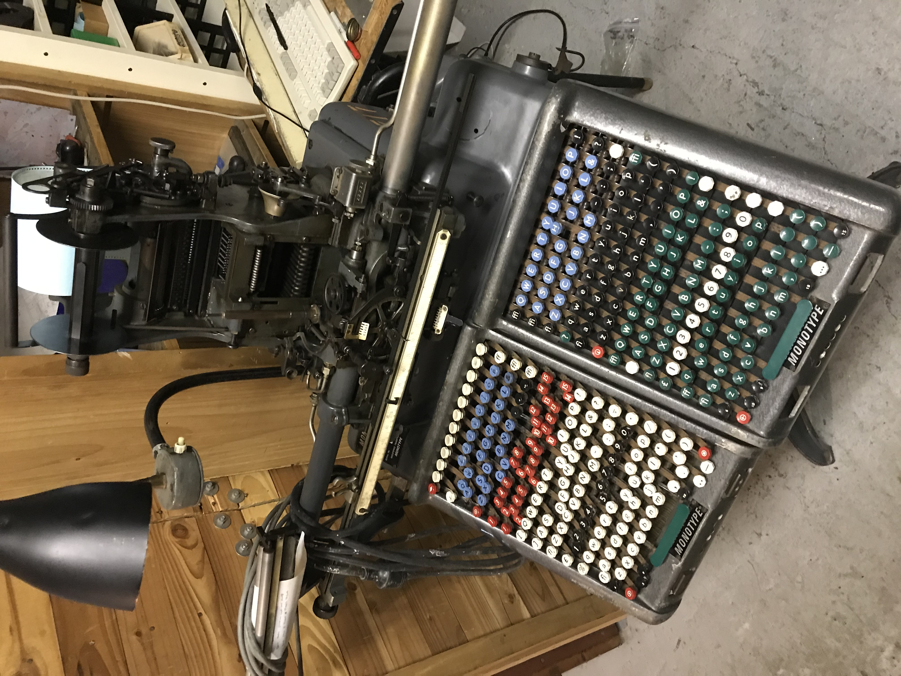
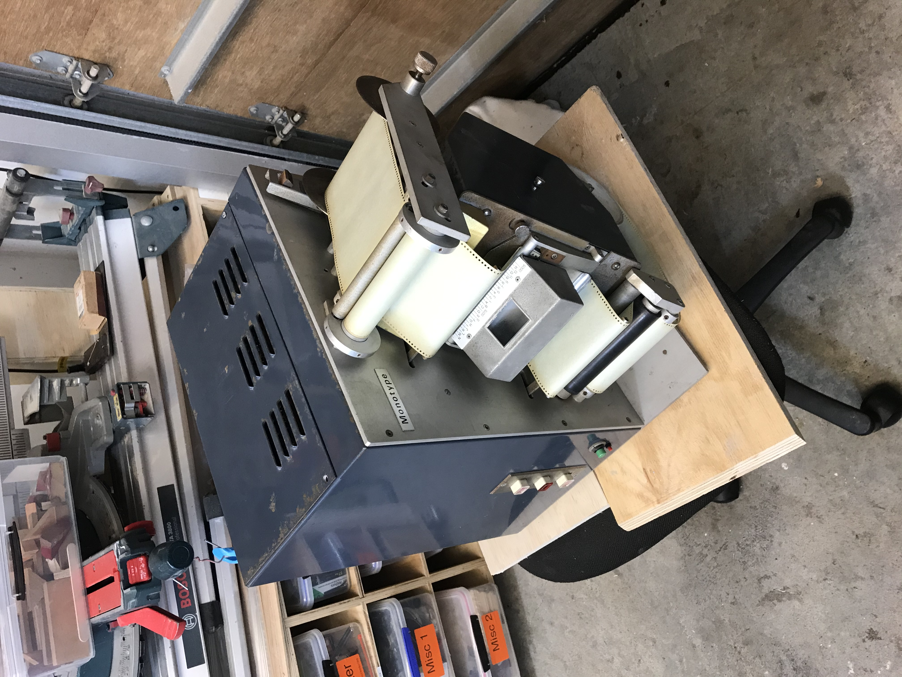
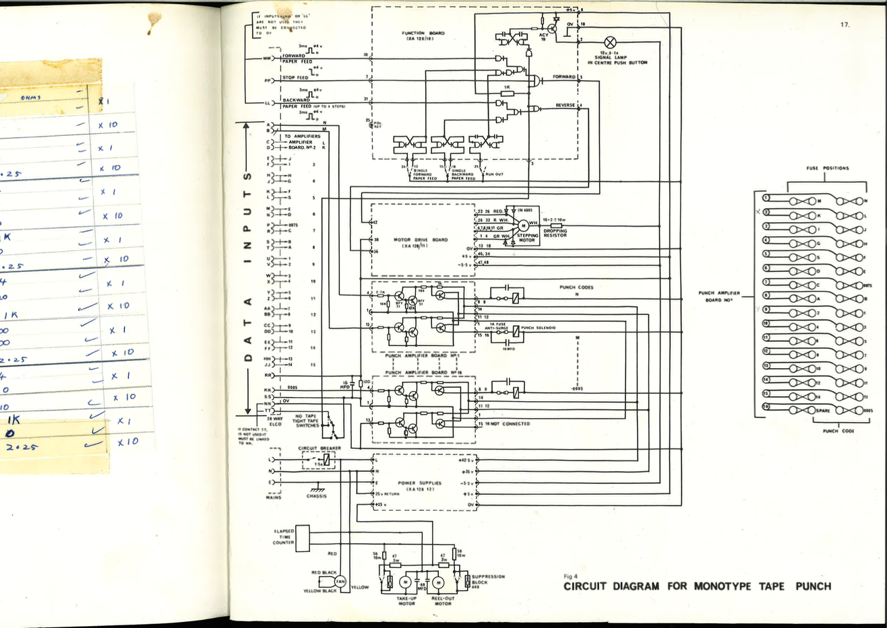
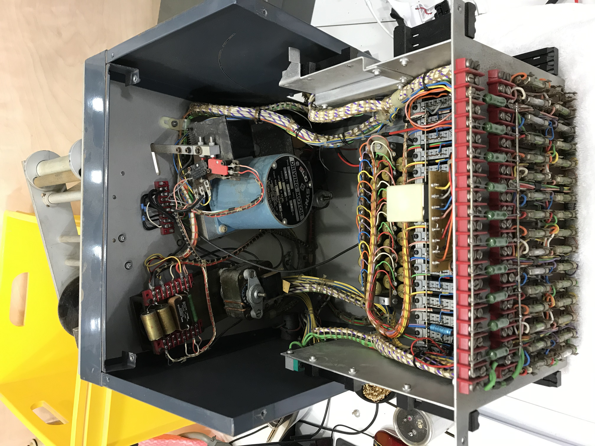
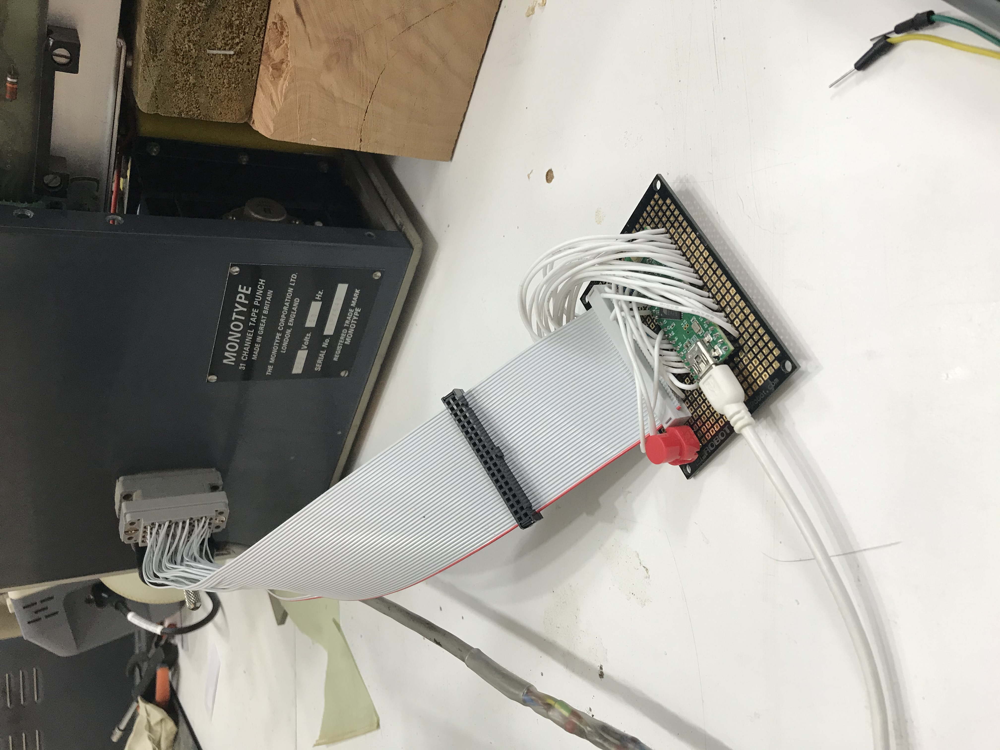
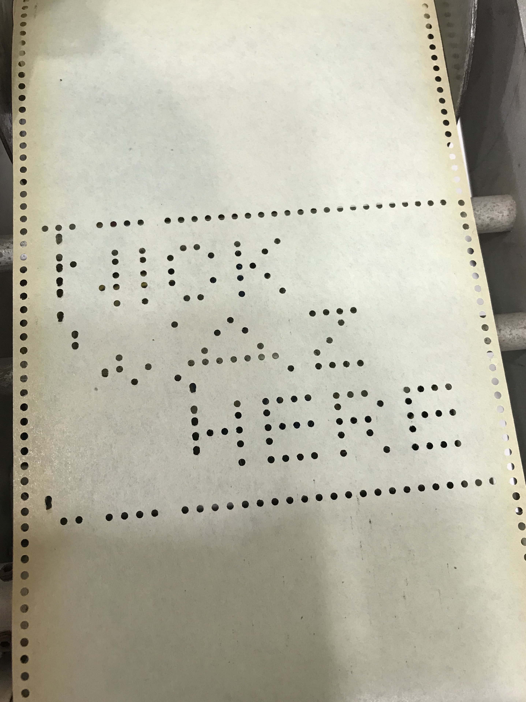
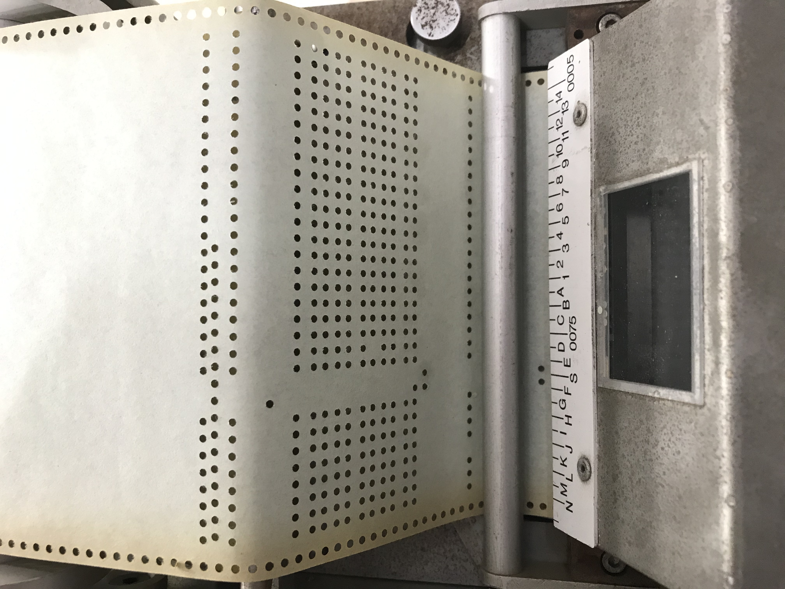
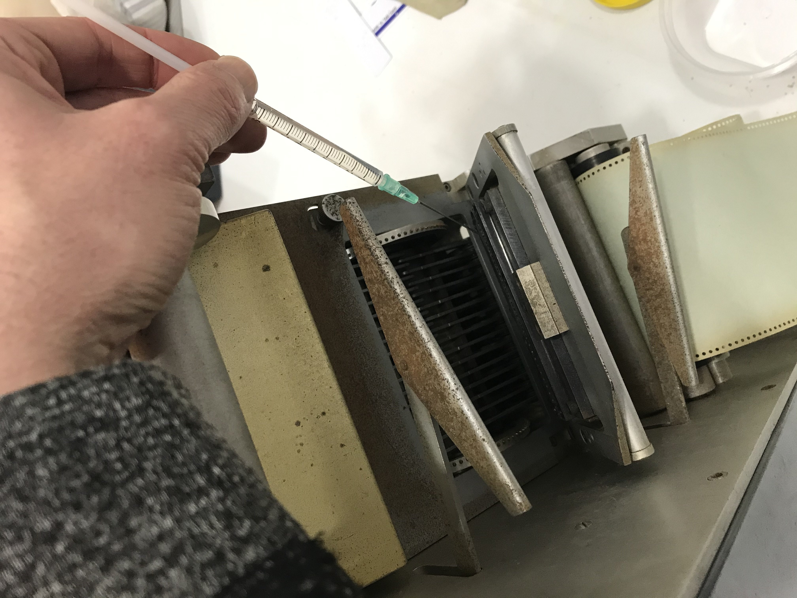
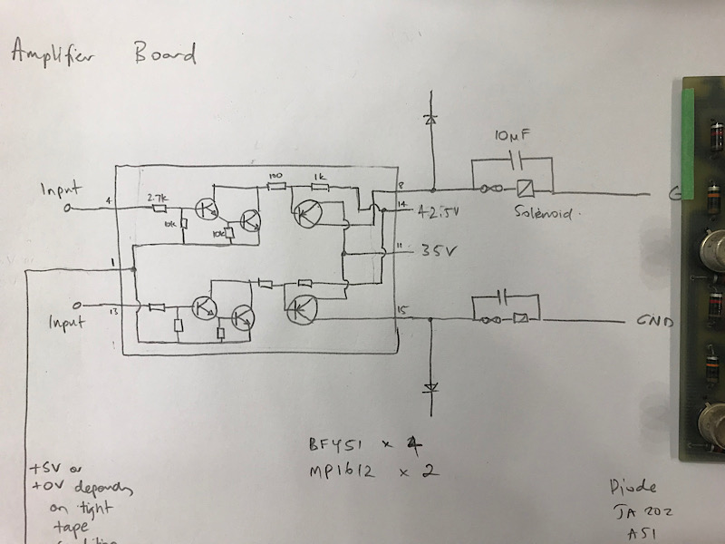
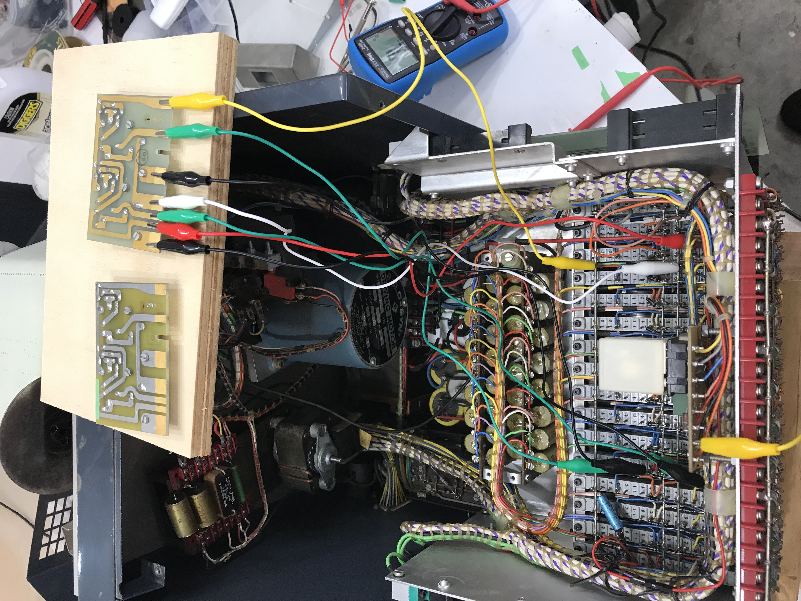

# The Monotype Punch

The first day I volunteered that the Print Museum I spent time in the bunker and was shown the mechanical marvel that is the Monotype Composition Caster. If you are not familiar with this piece of print history it casts paragraphs of text composed of individual characters. You generate the paragraph by sitting at a massive keyboard - every time you strike a key, it punches a series of holes into a paper tape. The holes represent the X and Y coordinates of the character you want contained in a matrix, holding upwards of 255 different characters.

Once you have finished typing you take the roll of paper off the keyboard and feed it into the composition caster. The caster then reads the punch patterns, moves the matrix case to the appropriate position, casts the individual character, then the process repeats until you have cast all the characters you typed on the keyboard.

I am over simplifying things at the moment, but until you see one of these running it is hard to grasp how mechanically complex this system actually is.

When I was first introduced to the Composition Caster it was being driven by a short length of plastic tape that had been laser cut. This was to make it easier for testing the caster independently of the keyboard. This did make me wonder if there was any way to drive the system by computer. I was told about a couple of different systems that consisted of computer controlled air valves (as the caster ‘read’ the tape by blowing compressed air though the punched holes) but with 31 channels there were quite an expensive proposition.

I was also told that Monotype did produce a computerised system for punching tapes that replaced the keyboard with a computer - but this was a bit of a unicorn. Often talked about but never seen.

I did wonder if you could make a dedicated device with a laser from a DVD recorder to burn holes in the paper tape (a sort of poor mans laser cutter, specific to this purpose) but the idea was shelved.

Fast forward to the Melbourne Print Museum auction - the unicorn had been found. A full monotype computer system, complete with 31 channel punch unit! I put my hand up to have a look at the punch and see if we could hook it up to a modern computer (I was not game to try and get the 1960’s ‘computer’ that it came with operational). Luckily we had circuit diagrams for most of the punches internals along with some technical documentation explaining how to drive the punch. Should be an easy job to get operational…

First job was to open it up and see if there was anything obviously wrong - who knows when the last time this punch had been working.

The punch has two different power supplies - a regulated 5V supply for the electronics and an unregulated supply for the punch solenoids, motors, lamps etc. Ended up replacing one of the capacitors with a modern equivalent, a couple of fuses but everything else checked out OK and the power supplies were putting out the correct voltages.

Problem was, when I connected it up it would always report a “tight tape” error - this error occurs when the motor winds up the tape too far and stops the machine.

I went over the wiring, tracing the microswitches that sense the tape condition, checking that they were doing what was expected and not sending a false “tight tape” error and was confident that this was not the fault.

This left the “function board” as the potential culprit, but even having a professional electronics repair technician look at it did not reveal any problems with the components. I spent hours tracing all the wiring, comparing to the circuit diagrams we had showing how the internals worked. Only thing was, our punch had a circuit board that was not present in the original schematics. Tracing the spaghetti wiring, the board was connected into the same lines that controlled the tight tape condition - but I could not figure out what exactly the board did, or how to control the relay that was on the board that seemed to be the crux of our problem… and I still don’t - I ended up bypassing it. Finally no more tight tape!

From the technical documentation I could see that it was a pretty easy control mechanism - apply 5V for 2.8ms to one of the pins on the connector to active the appropriate solenoid to punch the hole in the paper.

5V logic is pretty old school - a lot of modern microcontrollers are 3.3V, and I needed at least 31 outputs, one output per channel. Hunting though the specifications, this pointed to the Teensy++ 2.0 as the ideal microcontroller - 5V logic and 46 outputs. Perfect.

Amazingly you could still also purchase the Edac 516-038 plug that is on the back of the punch, so I would not have to cut open the original cable (just in case some future sucker want to try and connect the punch up to the original computer)

Once all the components arrived it required some careful connecting of the everything together and writing some code to control the microcontroller to send the appropriate commands but soon enough we had a “Hello World” running and sending commands to the punch.

This revealed a new problem. A couple of the channels were not punching. I figured that potentially after all these years sitting, the punch pins might need cleaning - so after dismantling the punch assembly I got it down to a single channel not working. Progress.

Internally the punch has 16 “amplifier boards”. Each boards controls two channels and consists of a couple of transistors allowing the 5V signal to switch the 48V high current required to activate the solenoid. For protection, there are also 31 fuses. You can only run the solenoid for about 1 sec before the fuse is burnt out.

I remember that I had replaced one of the fuses and when I checked it again, it had burnt out. Hmmmmm. Maybe second time lucky? Nope, another burnt out fuse.

Ok, checking the circuit diagram, every one of these 16 boards was exactly the same, so I could swap two around to see if the problem moved. The faulty board was board number 4, so I swapped it with board 16 (as board 16 was the easiest to get to…) and replaced the fuse again. Nope same problem, it burnt out exactly the same fuse.

So my though was that the amplifier board was not the problem - another long hunt though the internal wiring, but now I had introduced my own code into the mix, so I spent a long time with an oscilloscope looking at this and checking the pulse widths and lengths in case for some reason the microcontroller was turning this channel on for too long…

I went back to the amplifier board, pulled this out of the edge connector and bodged wires onto it so I could run it outside the enclosure with the multimeter connected. One channel was always outputting 48V - this should only happen momentarily when it activated the solenoid to punch - so that at least explained why it was always burning the fuse.

Pulled board 16 and did the same thing. This appeared to be doing what was expected. No 48V on either channel.

The smarter more observant of you will have spotted the problem. There are 31 channels on the solenoid, while there are 16 control boards, each controlling 2 channels. My faulty board was board 4 and I was testing by swapping with board 16 - however board 16 actually only controlled 1 channel, while board 4 controlled 2. Turns out that both board 4 and board 16 had exactly the same fault - only on board 16 it didn’t matter as normally it only controlled a single channel. When I connected it in place of board 4, it exhibited the fault. What are the chances of that - identical faults on two different boards.

I won’t embarrass myself by confessing to how long this had me stumped for.

Once I realised the problem, a check of one of the transistors did reveal it to be faulty. Next problem - where do you get a Motorola MP1612A from. Most germanium transistor production ceased in the 1970s in favor of silicon. Could I replace it with something modern? How would that effect the operation if one channel was different to all the rest?

My cry for help was heard by Keith Bowen who happened to have an ideal replacement transistor. A quick solder job and amazingly enough the punch was alive and all channels were punching again.

Of course it turns out that getting the punch functional is actually only a small piece in a much larger puzzle. Next is actually understanding how to punch the holes in the right place on the tape so the Composition Caster actually does something…

Stay tuned for the next episode.
